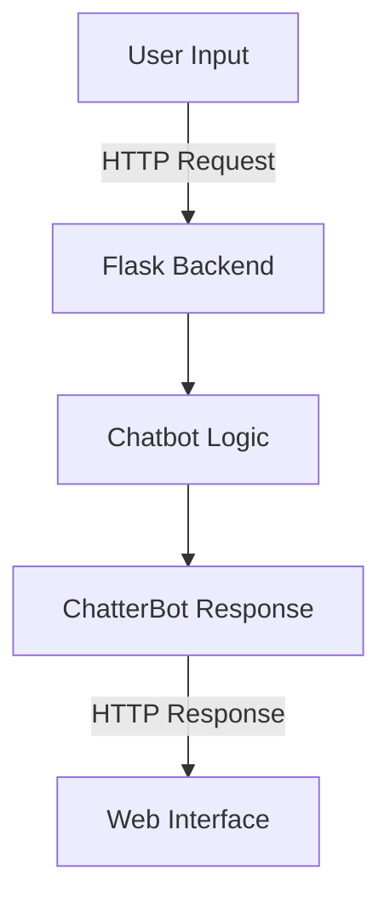

# Health & Disease Chatbot

Health & Disease Chatbot is an AI-powered conversational assistant designed to provide health-related advice, dietary tips, and answers to common queries about diabetes and general well-being. This project leverages the ChatterBot library for natural language processing and Flask for building the web interface.


---

## Features

- **Health-Centric Conversations**: Pretrained on health-related datasets to answer questions about diabetes management, prevention, and general symptoms.
- **Interactive UI**: User-friendly web interface built with HTML, CSS, and JavaScript.
- **Customizable**: Expandable dataset to include more health topics or customize chatbot behavior.
- **Real-Time Interaction**: Powered by Flask for seamless query handling.

---

## Table of Contents

1. [Installation](#installation)
2. [Usage](#usage)
3. [Technical Details](#technical-details)
4. [Dataset and Training](#dataset-and-training)
5. [Architecture Overview](#architecture-overview)
---

## Installation

### Step 1: Create a Virtual Environment

To avoid conflicts with global Python packages, it's best to create a separate virtual environment for this project.

1. **Create a virtual environment**:

   ```bash
   python -m venv chatbot_env
   ```

2. **Activate the virtual environment**:

   - On Windows:
     ```bash
     chatbot_env\Scripts\activate
     ```
   - On macOS/Linux:
     ```bash
     source chatbot_env/bin/activate
     ```

3. Once the environment is active, the command prompt should indicate you're inside the `chatbot_env`.

### Step 2: Install Dependencies

With the virtual environment activated, install the required libraries:

1. **Install ChatterBot**:
   ChatterBot is the core library used for creating the conversational AI. Install it using:

   ```bash
   pip install chatterbot==1.0.5 chatterbot_corpus==1.2.0
   ```

   **What They Do**:

   - `chatterbot`: Provides the chatbot framework, logic adapters, and training mechanisms.
   - `chatterbot_corpus`: Includes prebuilt datasets for training conversational agents.

2. **Install Flask**:
   Flask powers the web interface for the chatbot. Install it using:

   ```bash
   pip install flask
   ```

3. **Install Other Dependencies**:
   Install any additional libraries required for the project:

   ```bash
   pip install flask_cors numpy SQLAlchemy
   ```

### Step 3: Verify the Installation

Run the following command to check if all dependencies are installed:

```bash
pip list
```

You should see the following (or similar) libraries in the output:

- `chatterbot`
- `chatterbot_corpus`
- `flask`
- `flask_cors`
- `numpy`
- `SQLAlchemy`

---

## Usage

### Web Interface

- Open the chatbot interface in your browser.
- Type your health-related query (e.g., "What should I avoid if I have diabetes?").
- Receive informative and concise responses from the chatbot.

### Command-Line Interface

Run the `main.py` script for a CLI experience:

```bash
python main.py
```

---

## Technical Details

### Key Components

- **Flask**: Backend framework for web interface.
- **ChatterBot**: Library for conversational AI.
- **HTML/CSS/JS**: Frontend technologies for an interactive interface.

### File Structure

```
/health-chatbot
├── app.py               # Flask app entry point
├── chatbot_logic.py     # Core chatbot logic and training
├── data/
│   └── health_data.py   # Dataset for chatbot
├── requirements.txt     # Required dependencies
├── static/
│   └── style.css        # Styling for web UI
└── templates/
    └── index.html       # Frontend HTML template
```

---

## Dataset and Training

The chatbot is trained on a dataset of curated health conversations about diabetes and general health topics. It uses ChatterBot's `ListTrainer` to build responses tailored to the dataset.

---

## Architecture Overview



